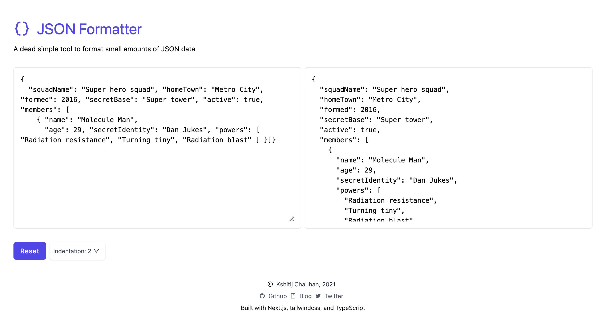

# JSON Formatter

A dead simple JSON formatting utility for the browser.

I built this project to learn the basics of Next.js and tailwindcss.



## Development

Make sure you have Node.js and NPM installed. Then follow the steps below:

First, run the development server:

```bash
npm run dev
```

Open [http://localhost:3000](http://localhost:3000) with your browser to see the result.

You can start editing the page by modifying `pages/index.tsx`. The page auto-updates as you edit the file.
